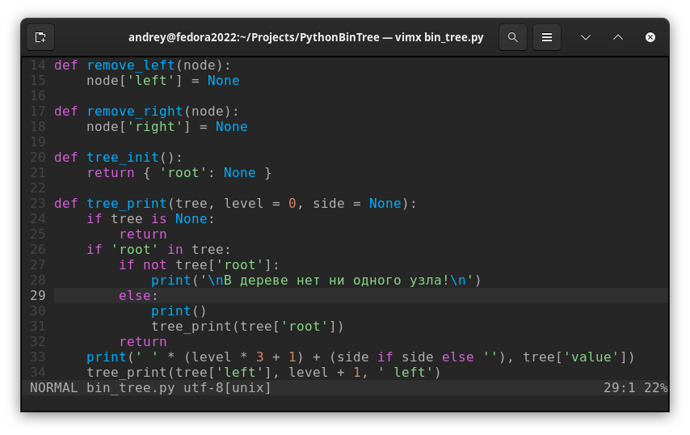

# Любимые плагины для Vim / NeoVim

Здесь я описываю только то,
что мне самому было нужно и то что мне зашло.

## Установка плагинов в Vim

Как менеджер плагинов я использовал раньше [vim-plug](https://github.com/junegunn/vim-plug).

Менеджер плагинов ставится командой (из ссылки выше)
```bash
curl -fLo ~/.vim/autoload/plug.vim --create-dirs \
    https://raw.githubusercontent.com/junegunn/vim-plug/master/plug.vim
```

Плагины добавляются в .vimrc вот так:

```vim
call plug#begin('~/.vim/plugged')

Plug 'github-user/repository-name' " плагин
let g:some_plugin_some_param = 1   " настройки плагина (необязательно!)

Plug 'other-user/other-repository' " другой плагин
let g:some_plugin_some_param = 1   " о том как настроить пишут в доке плагина

call plug#end()
```

и устанавливаю их командой `:PlugInstall`,<br>
перед этим перезапуская Vim или перезагружая конфиг с помощью команды `:source ~/.vimrc`.

Буду использовать `C` как сокращение для `Ctrl`, т.е например `C-x` значит `Ctrl + X`.

## Темы

### OneDark

[onedark.vim](https://github.com/joshdick/onedark.vim) \
[onedark.nvim](https://github.com/navarasu/onedark.nvim)

<!--  -->

## Общие плагины (независимо от типа файла)

### Автоматическое переключение языка ввода

[ссылка](https://github.com/lyokha/vim-xkbswitch)

Команды в нормальном режиме можно набирать только на английском языке.
Набирать `вв` вместо  `dd` или `з` вместо `p` нельзя.

Это очень неудобно, когда набираешь текст на двух языках сразу.
Плагин автоматически переключает язык на английский, при переходе в нормальный режим,
и в режиме вставки восстанавливает тот язык, который был до перехода в нормальный режим.

Плагин требует зависимого от ОС переключателя языка
>XkbSwitch requires OS dependent keyboard layout switcher.

Подробно можно почитать по ссылке, для GNOME 40+
я использую [g3kb-switch](https://github.com/lyokha/g3kb-switch),
который уже опакечен под Fedora (устанавливается одной командой).

### Авто-вставка парных симвлов

[auto-pairs](https://github.com/jiangmiao/auto-pairs) \
[nvim-autopairs](https://github.com/windwp/nvim-autopairs)

Плагин, который автоматически добавляет закрывающую скобку нужного типа, кавычку и.т.д.

### Действия со скобками

[vim-surround](https://github.com/tpope/vim-surround) \
[nvim-surround](https://github.com/kylechui/nvim-surround)

Плагин позволяет поставить парные символы вокруг текста или изменить их.

Командой `S(` в режиме выделения (visual) можно добавить
скобки (или другие парные символы, например кавычки) вокруг выделенного текста.
Это работает даже с HTML-тегами, например `S<div>` добавит открывающий и закрывающий тег вокруг текста.

Командой `cs"'` можно изменить тип кавычек (работает с любыми парными символами).

На момент написания заметки, у плагина слегка странное поведение,
если использовать команду `S(`, то кроме скобок добавляется
по одному пробелу (внутри скобок, до и после текста), если
использовать команду `S)`, тогда лишние пробелы не добавляются,
а плагин понимает что нужно до текста вставить `(`, а после текста `)`.

Для изменения тега используется команда `cst<tag>`.

Для удаления скобок команда `ds(`.

Также для добавления круглых скобок используется `Sb`.

По ссылке ниже еще больше про этот плагин. \
[Adding parenthesis around highlighted text in Vim](https://superuser.com/questions/875095/adding-parenthesis-around-highlighted-text-in-vim/875160)

### Вставка с нужным отступом

[ссылка](https://github.com/sickill/vim-pasta)

Плагин переопределяет стандартные команды `p` и `P`
таким образом, чтобы вставленный кусок кода автоматически
выравнивался и отступ соответствовал уровню вложенности.

### Комментирование кода

[caw.vim](https://github.com/tyru/caw.vim) \
[nvim-comment](https://github.com/terrortylor/nvim-comment)

Плагины, с помощью которых очень легко
закомментировать / раскомментировать часть кода.

Я сейчас использую __nvim-comment__.
Закомментировать и расскоментировать выделенный код
или текущую строку можно командой `gcc`.

`gc4j` позволяет закомментировать / расскоментировать
текущую строку и 3 строки ниже, т.е 4 строки, начиная с текущей.

### EditorConfig

[editorconfig-vim](https://github.com/editorconfig/editorconfig-vim) \
[editorconfig.nvim](https://github.com/gpanders/editorconfig.nvim)

__UPDATE.__ \
В Vim уже есть встроенная поддержка EditorConfig. \
В NeoVim уже есть встроенный плагин для этого, который включен по умолчанию.

EditorConfig это специальный файл, в котором задаются параметры, такие как
ширина отступа, тип отступа (пробел / таб), символ "конец строки" (Win / Unix) и.т.д.

А IDE / редакторы с помощью плагина, для каждого конкретного проекта выставляют нужные настройки,
таким образом в одном редакторе можно поддерживать разные отступы, line ending'и для разных проектов.

Это удобно для работы в команде, с одним EditorConfig
для одного проекта будут одинаковые настройки (отступы и вот это всё) в разных IDE.


### Дерево файлов

[nerdtree](https://github.com/preservim/nerdtree) \
[neo-tree.nvim](https://github.com/nvim-neo-tree/neo-tree.nvim) \
[nvim-tree.lua](https://github.com/nvim-tree/nvim-tree.lua)

### Навигация по файлам

[ctrlp.vim](https://github.com/ctrlpvim/ctrlp.vim) \
[fzf.vim](https://github.com/junegunn/fzf.vim) \
[fzf-lua](https://github.com/ibhagwan/fzf-lua) \
[telescope.nvim](https://github.com/nvim-telescope/telescope.nvim)

Плагины для быстрого поиска файла по имени.
Для NeoVim "стандартом" является __telescope.nvim__.
Для Vim - __fzf.vim__. __fzf.lua__ это __fzf__ под NeoVim.

### nvim-spectre

[ссылка](https://github.com/nvim-pack/nvim-spectre)

Плагин для удобного поиска и замены.
Не пробовал, но думаю годная штука.

_A search panel for neovim._ \
_Spectre find the enemy and replace them with dark power._

## Плагины для Markdown

### markdown-preview.nvim

[ссылка](https://github.com/iamcco/markdown-preview.nvim)

Плагин позволяет просматривать .md файл
в браузере и автоматически меняет страницу при любых изменениях файла
(сохраненять файл для этого не нужно).
Сервер требует установленного Node.js и yarn, а запускается командой `:MarkdownPreview`.

```vim
Plug 'iamcco/markdown-preview.nvim', { 'do': 'cd app && yarn install' }
let g:mkdp_page_title = '${name}.md'
```

### vim-table-mode

[ссылка](https://github.com/dhruvasagar/vim-table-mode)

Плагин позволяет выравнивать текст в таблицах в Markdown файлах.
Это очень удобно: просто набираешь таблицу и не думаешь как сделать так, чтобы
в "сыром" виде она смотрелась красиво. Текст выравнивается в таблицах автоматически при наборе.

Плагин даже если его подключить (с помощью менеджера плагинов),
сам работать не начнёт в открытом Markdown-файле. Для того чтобы плагин начал работу,
необходимо набрать `<Leader>tm` (по умолчанию `\tm` если `<Leader>` не переопределен).

### vim-markdown-folding

__Не пробовал.__

[ссылка](https://github.com/masukomi/vim-markdown-folding)

_This plugin enables folding by section headings in markdown documents._

Плагин для того, чтобы сворачивать часть документа под заголовком.

### vim-markdown

__Не пробовал.__

[ссылка](https://github.com/preservim/vim-markdown)

Какой-то набор полезностей для более удобной работы с Markdown.


## LaTeX

### vimtex

__Не пробовал.__

[ссылка](https://github.com/lervag/vimtex)

Плагин для сборки .tex файлов.
Команда для сборки `:VimtexCompile`.
Можно настроить программу, в которой откроется собранный файл,
я использую Zathura.

```vim
Plug 'lervag/vimtex'
let g:vimtex_view_method = 'zathura'
```

##  JavaScript / TypeScript

[vim-js](https://github.com/yuezk/vim-js)
[vim-jsx-pretty](https://github.com/maxmellon/vim-jsx-pretty)
[yats.nvim](https://github.com/HerringtonDarkholme/yats.vim)

Плагины, которые я использую для корректной подсветки синтаксиса JavaScript и TypeScript.
__UPDATE.__ Возможно это уже неактуально, особенно для NeoVim с его TreeSitter.

```vim
Plug 'yuezk/vim-js'
Plug 'maxmellon/vim-jsx-pretty'
Plug 'HerringtonDarkholme/yats.vim'
```

